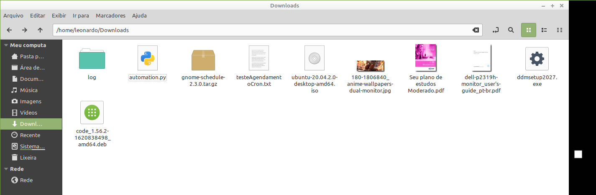
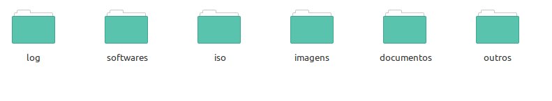
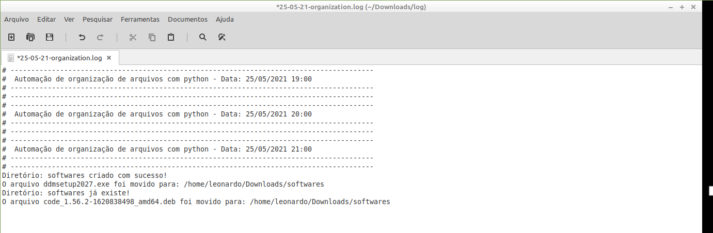

# Python

## 🌱 Projeto

- Script para `organizar por categoria os arquivos` do diretório download

## Requisitos

- python 3

## Diretório raiz

- O `diretório raiz` é criado de acordo com o Sistema Operacional, no meu caso foi o linux.

## Como funciona
Colque o `script` dentro do diretório `downloads`



- Execução - Manual

```bash
python3 organization.py
```

- Execução `criando log` (Crie um diretório log, dentro do diretório downloads

```bash
python3 organization.py >>~/Downloads/log/log.txt
```

- Nomeando o `log` com a data 

```bash
$ python3 automation.py >>~/Downloads/log/$(date +%Y_%m_%d)-log.txt
```

## Estrutura dos diretórios

- Crie o diretório `log` dentro de `downloads`

- Após rodar o `script` os diretórios serão criados e os arquivos serão movidos para suas respectivas pastas.



## Utilizando cronjob para agendamento do scrip

- Visualizando os `cronjobs` do sistema

```bash
$ sudo crontab -l
```

- Configurando um `cronjob` para rodar de 1 em 1 hora.

```bash
$ sudo crontab -e
```

- Adicione a segunte linha

```
0 */1 * * * cd ~/Downloads && python3 automation.py >> ~/Downloads/log/`date +\%d-\%m-\%y`-organization.log 2>&1
```

# Logs

- Os logs seráo armazenados dentro do diretório `log` que você criou.




## Referências

- https://medium.com/swlh/automation-python-organizing-files-5d2b6b933402
- https://dev.to/akashsenta13/python-script-to-organize-files-in-folders-5783
- https://docs.python.org/pt-br/3.7/library/shutil.html
- https://docs.python.org/pt-br/3/library/os.html


